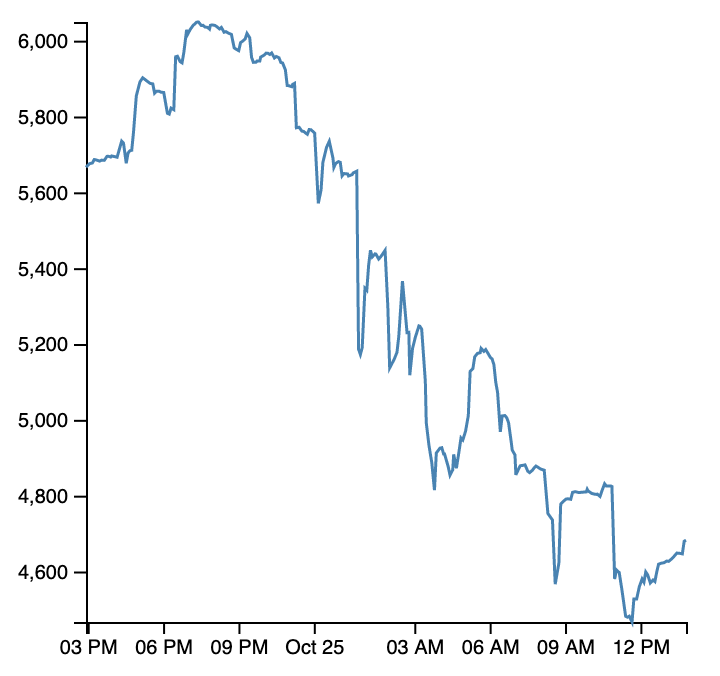

# WASM / Rust / D3 example

Fetch data with Rust + WASM and show it with JS + D3.



Scaffolding created using [wasm-pack](https://github.com/rustwasm/wasm-pack)

Instructions:

```sh
wasm-pack build
```
in root folder, to build Rust and generate JS bindings

```sh
npm run start
```
in www folder, to start local server.

Open http://localhost:8080/ in browser.

